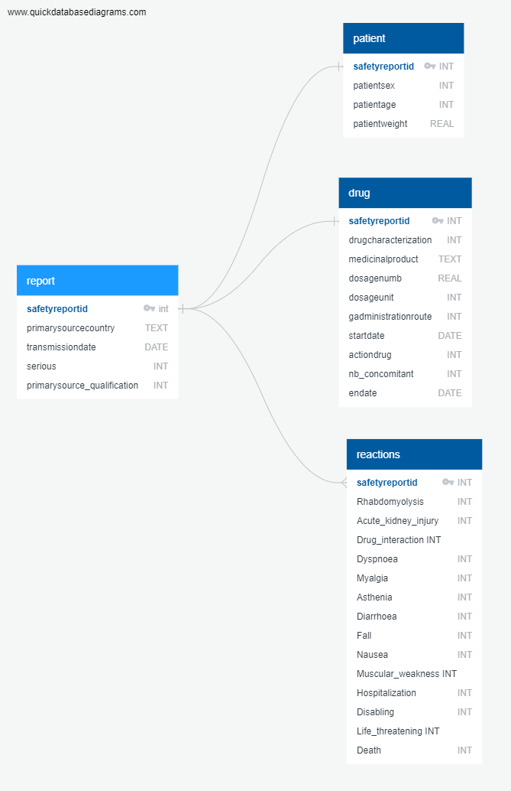
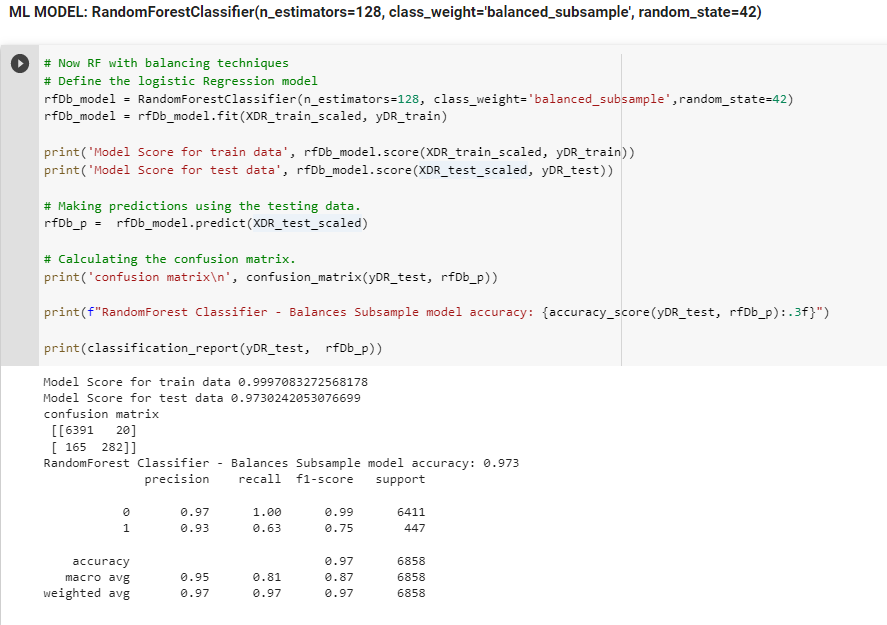
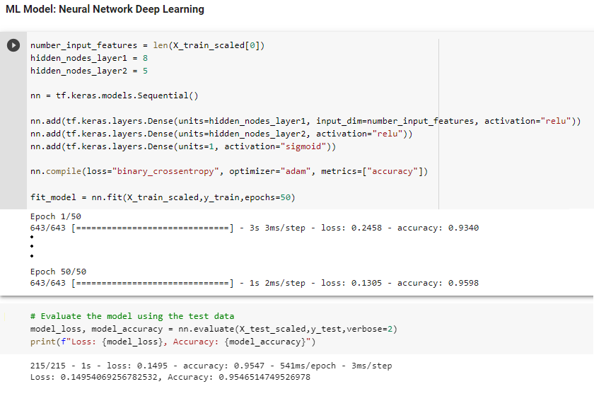
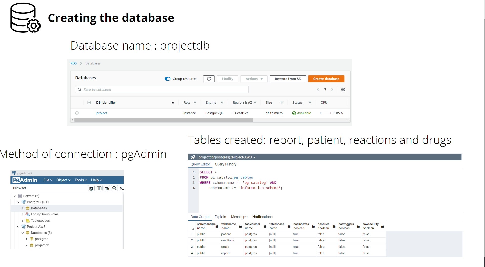

# Analysis of adverse reaction of FDA Approved medicine class STATINS

## Presentation

This project will be a supervised machine learning of Classification type. 

### Selected topic 
Taking the most prescribed drug class, Statins (Cholesterol lowering medications), leading to hospitatlization and death.


### Reason why this topic was selected 
To be able to predict the incidences of hospitalisation or death based on an adverse effect dataset from FDA.

We wanted to work with a real-world dataset, and from this data set, we could ask and answer a question about an important question that could be anyone's question and concern, no matter where in the world they live or what in the world they do. 

### Description of the source of data 
This is a dataset provided by the FDA based upon submissions by medical professionals about medications and their (adverse)effects on those who take them.
It is important to mention that our datasource is limited to the reported cases.

### Questions the team hope to answer with the data
The question to answer is the likelihood of getting hospitalised or dying if experiencing any adverse effects by taking this medication. Using a supervised machine learning classificaion method, we want to be able to predict, -by looking at the age, gender, adverse reactions, drug indication- whether the patient will have serious reactions to any of statins, leading to  hospitalisation or not and whether they will have very serious reactions that may cause death or not. 


### Database Mock Up (Preferably a ERD - Entity Relationship Diagram)


### Diagram of Data Pipeline (ETL, Database, and Machine Learning model)


### Description of the data exploration phase of the project

While exploring the data, we realized that some of the fields have many missing values, such as patient's weight, some of the fields' categorical data have about 500 different unique values, and some have obvious input mistakes. If we wanted to drop all the missing values blindly, we would have been left with a relatively small dataset to work with and not enough data to be able to train our machine learning models efficiently and get a high performance model capable of making predictions with the desired level of accuracy.

To fix the missing numerical values issue, we decided to use some of the existing methods to fill some of the missing values, in this case we used Iterative Imputing, that uses a function to predict the missing values based on the existing values and other features.

The approach we took for the categorical data with numerous unique values, was to group them depending on their values. Using this approach we were able to bring down the number of unique values to about 16 categories and then encode them into numerical features using (oneHotEncoder)

The fields where data had obvious input mistake, we corrected the issue with pandas replace method.

Taking advantage of these methods helped us save a healthy percentage of our original dataset, while giving us confidence that we stayed true to the original dataset.

Example of regrouping in order to decrease the number of categorical data (in this case countries):

```
ctydict = df['primarysourcecountry'].value_counts().to_dict()
for c in ctydict:
  if ctydict[c] <= 300:
    df['primarysourcecountry'] = df['primarysourcecountry'].replace(c,"Other")

df['primarysourcecountry'].value_counts()
```

Example of filling missing values (in this case patient's weight) using Iterative Imputing:

```
weight_imputer = IterativeImputer(random_state=42)
df['patient_patientweight'] = weight_imputer.fit_transform(df[['patient_patientweight']])
```

Example of filling missing values
```
# Fill missing values from seriousnesscongenitalanomali with 0 since if someone does not have congenital anomali, the value is supposed to be 0
df['seriousnesscongenitalanomali'].fillna(0,inplace=True)
```

Example of grouping values to decrease the number of categorical data (in this case drug indications)
```
covid_related_indications = ['COVID-19 PNEUMONIA','COVID-19 immunisation','COVID','COVID-19']
for i in covid_related_indications:
  df['patient_drug_drugindication'] = df['patient_drug_drugindication'].apply(
    lambda row : "COVID" if str(row) == i else row
    )
```

### Description of the analysis phase of the project

After the preprocessing of our data, we decided on our features and targets for the machine learning portion of our project, and then were able to fit different ML models with our train data set and then test our models for performance and accuracy. 

This task was split between all the team members and each of us worked on different ML models, comprising of the less complex models such as Logistic Regression model and more complex ones such as Neural Network's deep learning models.

After extracting a classification report and accuracy score for each of our models, we realized that the model that is giving us the best results for predicting death and hospitalisation (taking into account precision and recall and other metrics) is Random Forest with Balanced subsample.

Some of the models we tried listed here (not limited to):

- Logistic Regression
- Random Forest (Balanced Subset)
- Support Vector Machines (SVM)
- Neural Networks (Deep Learning)

And their results:








### Technologies, languages, tools, and algorithms used throughout the project
* Data in the format of JSON retrieved from FDA Website using API, then converted to CSV, then stored to Amazon S3
* Python files to run on Google Colab will be using Pandas and PySpark libraries.
* The cleaned data will be loaded in a PostgreSQL on AWS.
* Data will be processed with a superised machine learning model potentially Neural Networks.
* Presentation Slides on Google Slides.
* For visualisation, we have used Tableau public and have stories and interactive dashboards.


### Visualization Blueprint
This is a visualization about statins in general:


### Database Connection




### Result of analysis
We came up with a couple of interpretations of the analysis:

***- Gender Differences***

Overall, there were more reports of men having adverse reactions than women. This could mean more men being prescribed statins, or men being more susceptible to adverse reactions from the use of statins. Most likely it is a combination of both. We could further explore this by obtaining overall usage statistics of statins over the same time period.

Women experiencing adverse effects from statins had a slightly higher rate of hospitalization than men, with men having a 44.9% chance of being hospitalized compared to 45.5% of women. 
	
Men had a significantly higher instance of death than women. Women who experienced adverse reactions from statins had a 5.0% chance of death, whereas men had a death rate of 7.6%.


***- Age and Weight Differences***

The age trend seems to follow that of an older population. Instances of adverse reactions and hospitalizations begin to become significant at around age 40 and peak at around age 70. Instances of death peak at around age 75, which is in line with average life expectancy.

Weight trends seem to follow that of an adult population. The highest incidence of adverse effects occurs in people weighing 80kg, which is the average weight of a North American. There are more instances above this weight than below, which suggests a higher instance of adverse reactions in those of above average weight.
	
What we can interpret from this is that statins are mainly prescribed to people above the age of 40, and that instances of side effects increase as people approach the age of 70. We can also interpret that while weight will not necessarily determine whether someone will have an adverse reaction, weighing 80kg or more will increase the likelihood of these reactions.


***- Differences between Medicinal Products***

The five medicinal products showed some key differences, mainly the prevalence of the use of Atorvastatin. More than half of all reported adverse effects occurred in patients taking Atorvastatin. Simvastatin and Rosuvastatin have the second and third most instances of adverse reactions respectively, making up the majority of the remainder of reports.

The most common side effect associated with Atorvastatin is Myalgia. Interestingly, the most common side effect associated with Simvastatin and Rosuvastatin is Rhabdomyolysis. As this is generally a more serious condition than myalgia, this could be a reason that Simvastatin and Rosuvastatin are prescribed less than Atorvastatin.

### Recommendation for future analysis
We recommend working with a bigger dataset and including other medicinal products 

### Anything the team would have done differently


### Link to our code:
[Code](https://colab.research.google.com/drive/1OnK27kfFz05AUs3EIdkArZ_w93yHvBJA?usp=sharing "Code")

### Link to the Google Slide Presentation:
[Presentation](https://docs.google.com/presentation/d/1gpLId618DzodGrncwFsHKa1xZkDsZFZXl6Yh6Q-xEaQ/edit#slide=id.p1 "Presentation Link")

#### Project done by this team (alphabetically ordered):
- Baldassarre, Nick
- Farahani, Tina 
- Leonard, Valerie
- Mostaghimi, Tannaz
